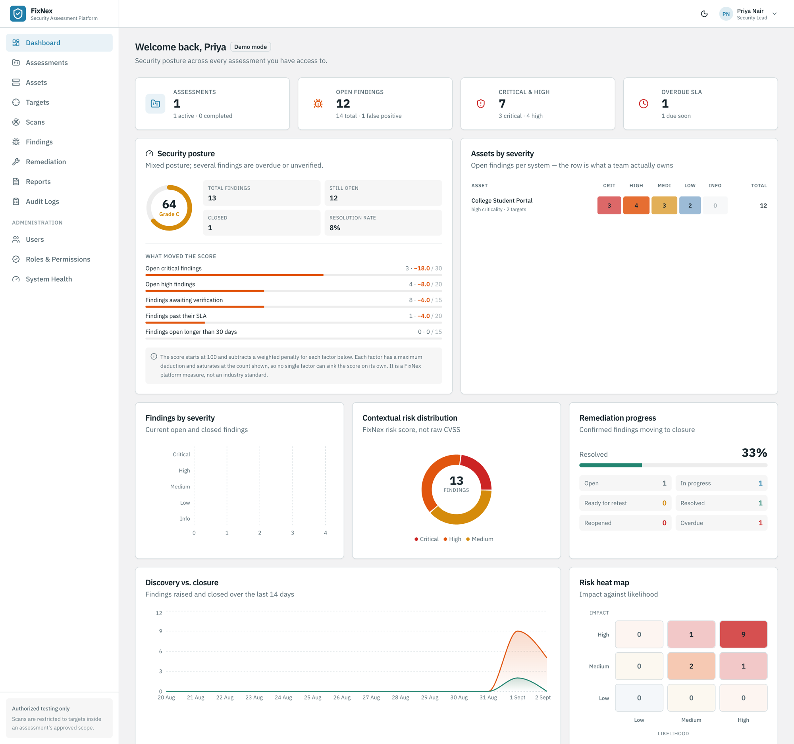
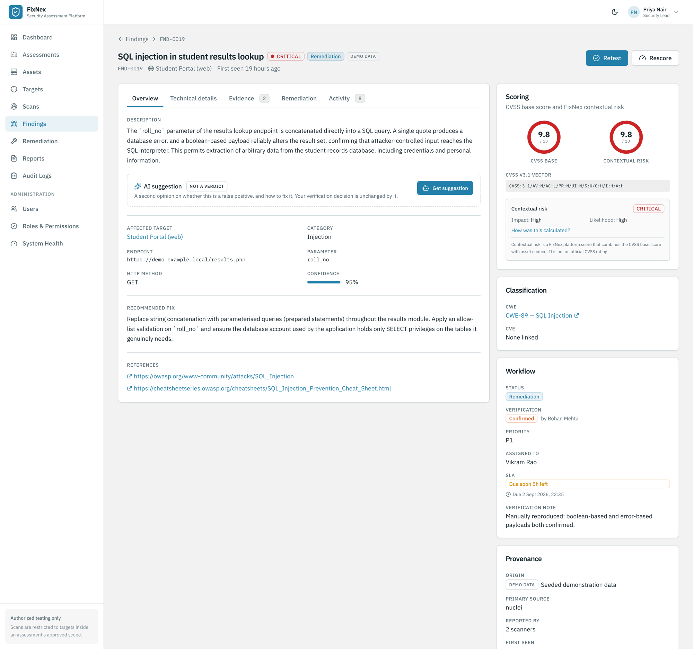
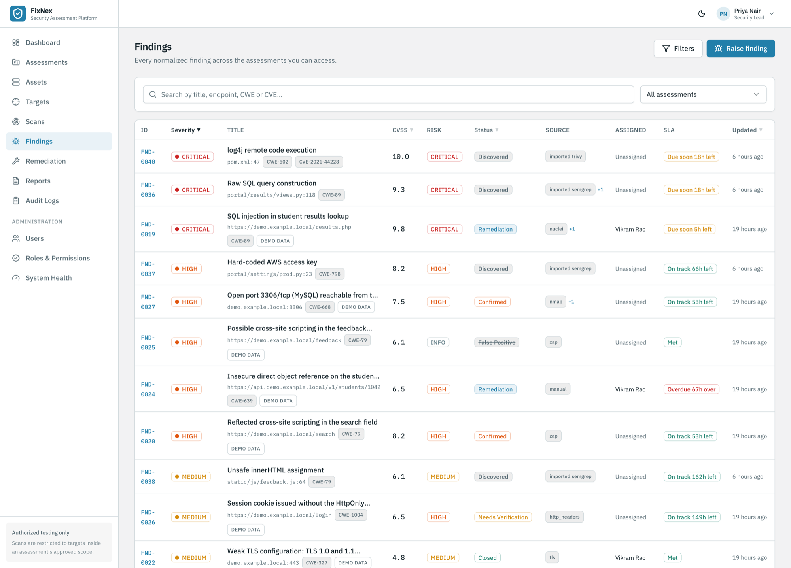
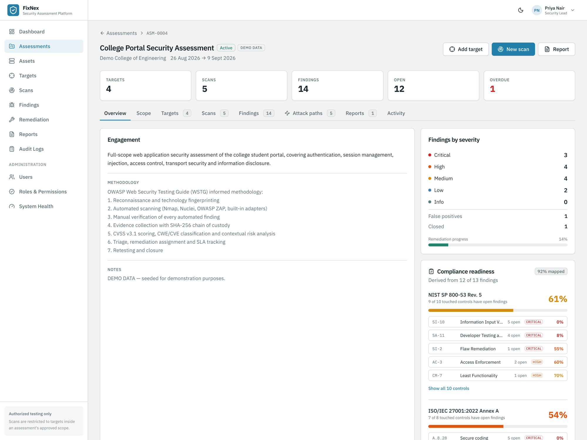
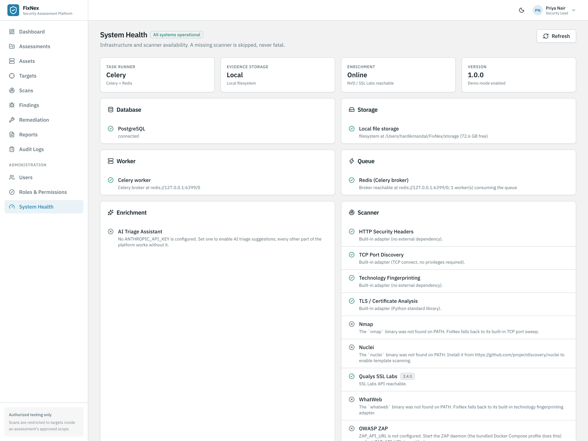
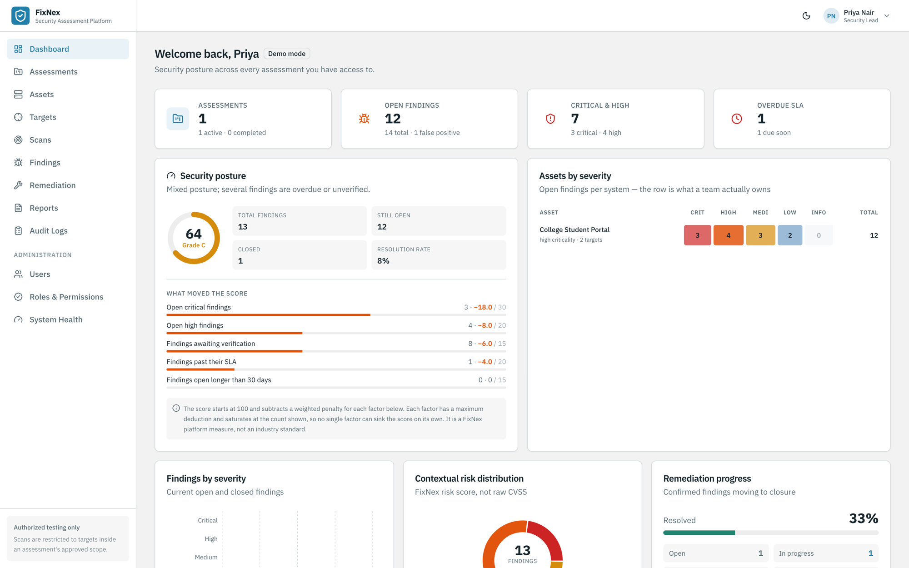
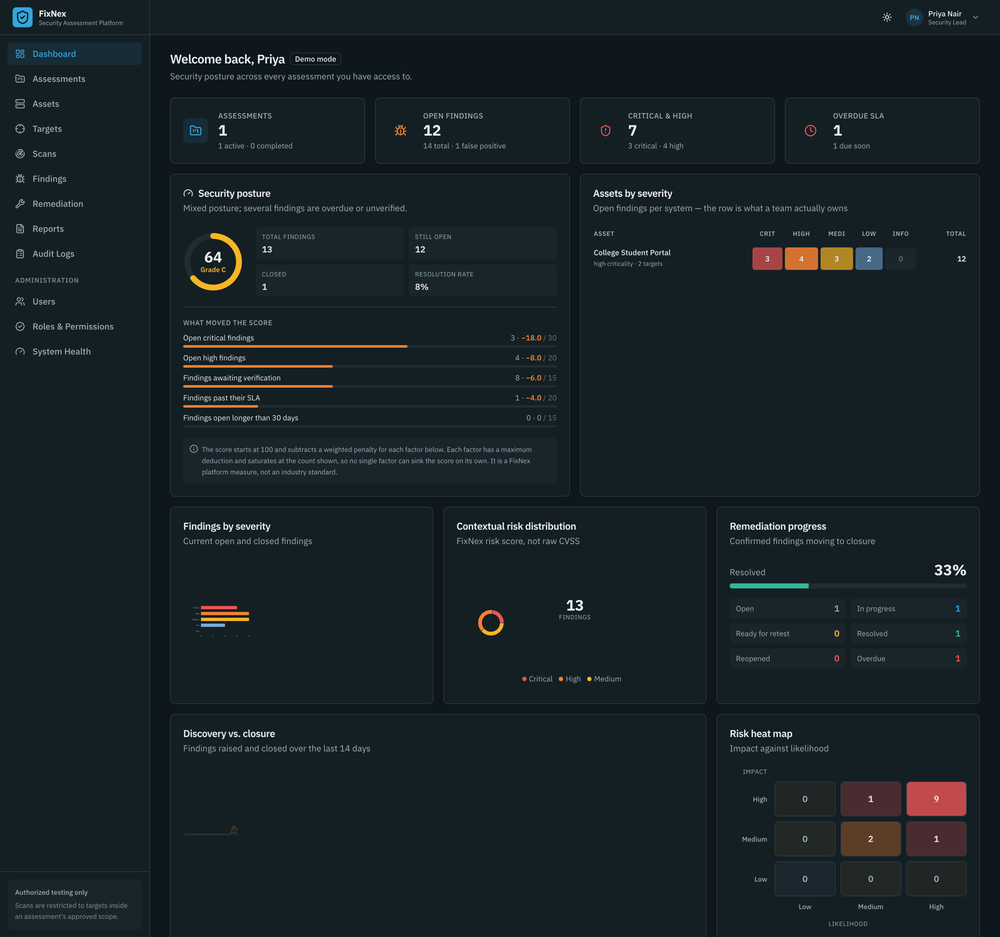

# FixNex

**Centralized Web Application Security Assessment Platform**

Security teams routinely run reconnaissance in one tool, scanning in another, track
verification in a spreadsheet, keep evidence in a folder, calculate risk by hand, chase
remediation over email and assemble the report manually at the end. The work is
connected; the tooling is not.

FixNex is the platform around those tools. It does **not** reimplement scanners — it
orchestrates them, normalizes what they produce, and manages the complete journey of a
security finding:

```
Security tools → Scanner adapters → Normalized findings → Correlation
   → Verification → Evidence → CVSS / CWE / CVE → Contextual risk
   → Triage → Remediation → Retest → Closure → Audit trail → Report
```



---

## Contents

- [What it does](#what-it-does)
- [Screenshots](#screenshots)
- [Architecture](#architecture)
- [Technology stack](#technology-stack)
- [Quick start (Docker)](#quick-start-docker)
- [Local development](#local-development-without-docker)
- [Demo credentials](#demo-credentials)
- [Demo walkthrough](#demo-walkthrough)
- [Scanner integrations](#scanner-integrations)
- [Security model](#security-model)
- [Roles and permissions](#roles-and-permissions)
- [Environment variables](#environment-variables)
- [API](#api)
- [Testing](#testing)
- [Project structure](#project-structure)
- [Design decisions](#design-decisions)
- [Future enhancements](#future-enhancements)

---

## What it does

| Capability | How it works |
|---|---|
| **Centralization** | One adapter per tool; all of them emit the same normalized finding format |
| **Correlation & dedup** | The same issue found by ZAP, Nuclei and a built-in check becomes **one** finding with three sources |
| **Authorized scanning** | Every scan is checked against the assessment's explicit scope; blocked attempts are audited |
| **Manual verification** | Analysts confirm or reject each automated finding; false positives are kept forever with a written justification |
| **Evidence** | Files live in object storage with SHA-256 hashes, versioning and chain of custody; screenshots can be annotated |
| **Scoring** | CVSS v3.1 from the reference implementation, CWE classification, CVE enrichment from NVD |
| **Contextual risk** | A separate, clearly-labelled platform score combining CVSS with asset criticality, data sensitivity and exposure |
| **Remediation & SLA** | Assignment, priority, per-severity SLA deadlines and on-track / due-soon / overdue tracking |
| **Retesting** | A passing retest closes the finding; a failing one reopens remediation, with full history |
| **Audit trail** | Append-only. There is no API route and no role permission that can edit or delete an audit record |
| **Reporting** | PDF, CSV, JSON, XLSX and HTML covering scope, methodology, findings, evidence, remediation and retests |
| **Broad tool coverage** | Any SARIF-emitting scanner (Semgrep, Trivy, Gitleaks, Snyk, Checkov, CodeQL…) imports into the same pipeline |
| **Attack paths** | Chain rules link findings that co-occur on a system into the higher-severity outcome they enable |
| **Compliance rollup** | Findings map to OWASP Top 10 and to NIST SP 800-53 / ISO 27001 controls, with per-control readiness |
| **Posture scoring** | One 0-100 score per assessment, always shown with the deductions that produced it |
| **AI triage (optional)** | A false-positive likelihood, reasoning and suggested fix, surfaced beside the analyst's own verify action — never applied automatically |

---

## Screenshots

<table>
<tr>
<td width="50%"></td>
<td width="50%"></td>
</tr>
<tr>
<td><b>Finding detail.</b> CVSS base score and the separate contextual risk shown side by
side, with the platform score explicitly labelled as such. CWE classification, workflow
state, SLA, and provenance that names the finding as seeded demo data rather than a real
scan result.</td>
<td><b>Findings.</b> Searchable and filterable across every assessment. The source column
shows which scanner reported each finding, with a <code>+n</code> where correlation merged
several tools into one record.</td>
</tr>
<tr>
<td width="50%"></td>
<td width="50%"></td>
</tr>
<tr>
<td><b>Attack paths.</b> Chains where one finding makes another materially more dangerous,
laid out prerequisite → enabler → outcome. Every edge carries a written rationale.</td>
<td><b>System health.</b> Every optional dependency reports itself honestly. A missing
scanner names its fallback rather than presenting as a failure.</td>
</tr>
<tr>
<td width="50%"></td>
<td width="50%"></td>
</tr>
<tr>
<td><b>Sign in.</b> Six demo roles, each seeing a different slice of the platform. Click a
role to fill the form.</td>
<td><b>Dark theme.</b> The same hue family taken to a deep slate-teal, so both themes read
as one product.</td>
</tr>
</table>

---

## Architecture

```
                    ┌──────────────────────────────────────────┐
   Browser ───────► │  React + Vite SPA                        │
                    │  RBAC-aware UI, live scan progress (WS)  │
                    └────────────────────┬─────────────────────┘
                                         │  REST + WebSocket
                    ┌────────────────────▼─────────────────────┐
                    │  FastAPI                                  │
                    │  routers → services → repositories        │
                    │  JWT auth · central permission matrix     │
                    └───┬───────────────┬──────────────────┬────┘
                        │               │                  │
              ┌─────────▼──────┐  ┌─────▼──────┐   ┌───────▼────────┐
              │  PostgreSQL    │  │  Redis +   │   │  MinIO         │
              │  source of     │  │  Celery    │   │  evidence &    │
              │  truth         │  │  workers   │   │  reports       │
              └────────────────┘  └─────┬──────┘   └────────────────┘
                                        │
                            ┌───────────▼────────────┐
                            │   Scanner adapters      │
                            │  ┌───────────────────┐  │
                            │  │ built-in (always) │  │
                            │  │  http_headers     │  │
                            │  │  tls              │  │
                            │  │  tech_fingerprint │  │
                            │  │  port_scan        │  │
                            │  ├───────────────────┤  │
                            │  │ external (opt.)   │  │
                            │  │  nmap  nuclei     │  │
                            │  │  zap   whatweb    │  │
                            │  │  ssl_labs         │  │
                            │  └───────────────────┘  │
                            └───────────┬────────────┘
                                        │  NormalizedFinding[]
                            ┌───────────▼────────────┐
                            │  Correlation engine     │
                            │  → deduplicated finding │
                            └─────────────────────────┘
```

### The scan pipeline

A Standard scan fans out to every available adapter, then funnels the results
through one pipeline:

```
  WhatWeb ──┐
  Nmap ─────┤
  Nuclei ───┼──► normalize ──► correlate ──► deduplicate ──► score (CVSS)
  ZAP ──────┤                                                    │
  built-ins ┘                                                    ▼
                                              classify (CWE) ──► enrich (CVE)
                                                                 │
                                              persist ◄── SLA ◄──┴── contextual risk
```

### Finding lifecycle

```
        DISCOVERED
             │
      NEEDS_VERIFICATION
             │
      ┌──────┴───────┐
FALSE_POSITIVE   CONFIRMED ──► TRIAGED ──► REMEDIATION ──► RETEST
      │                                         ▲            │
   (retained                                    │      ┌─────┴─────┐
    for audit)                                  └──FAIL┤           ├PASS──► CLOSED
                                                       └───────────┘
```

---

## Technology stack

**Backend** — Python 3.11, FastAPI, SQLAlchemy 2.0, Alembic, Pydantic v2, PostgreSQL 16,
Redis + Celery, MinIO, JWT (PyJWT), Argon2id (argon2-cffi), the `cvss` reference library,
Jinja2 + WeasyPrint (fpdf2 fallback), pandas + openpyxl.

**Frontend** — React 19, Vite, TypeScript, Tailwind CSS, shadcn/ui-style components on
Radix primitives, React Router, TanStack Query, Axios, React Hook Form + Zod, Recharts,
Motion (animation), Lucide icons. Type is IBM Plex Sans and IBM Plex Mono throughout,
with Space Grotesk reserved for the sign-in headline and wordmark.

---

## Quick start (Docker)

```bash
git clone https://github.com/FixnexToon/FixNex.git
cd FixNex
cp .env.example .env
python3 -c "import secrets; print('JWT_SECRET=' + secrets.token_urlsafe(48))" >> .env
docker compose up --build
```

| Service | URL |
|---|---|
| Application | http://localhost:5173 |
| API documentation (Swagger) | http://localhost:8000/api/docs |
| MinIO console | http://localhost:9001 |

The stack applies migrations and seeds the labelled demo dataset on first start.

To include the OWASP ZAP daemon (the heaviest service, so it is opt-in):

```bash
docker compose --profile zap up --build
```

---

## Local development (without Docker)

FixNex runs with **no** Redis, MinIO or scanner binaries installed — each dependency
degrades gracefully (see [Design decisions](#design-decisions)). You need Python 3.11+,
Node 20+ and PostgreSQL.

**Backend**

```bash
python3.11 -m venv .venv && source .venv/bin/activate
pip install -r backend/requirements.txt

cp .env.example .env      # then set DATABASE_URL and JWT_SECRET

cd backend
alembic upgrade head              # create the schema
python -m app.cli seed-demo       # load the labelled demo dataset
python -m app.cli check           # report what is and is not available
uvicorn app.main:app --reload
```

**Frontend**

```bash
cd frontend
npm install
npm run dev        # http://localhost:5173, proxies /api to :8000
```

**Management commands**

```bash
python -m app.cli check                 # component + scanner health
python -m app.cli migrate               # apply migrations
python -m app.cli seed-demo             # (re)seed demo data
python -m app.cli create-user --email you@example.com --name "You" \
                              --password 'ChangeMe123' --role ADMIN
```

---

## Demo credentials

All demo accounts use the password **`DemoPass123!`**

| Role | Email | What they can do |
|---|---|---|
| Administrator | `admin@fixnex.io` | Everything, including users and settings |
| Security Lead | `lead@fixnex.io` | Assessments, scope, team, triage, assignment, reports |
| Security Engineer | `engineer@fixnex.io` | Run scans, verify findings, rescore, retest |
| Analyst | `analyst@fixnex.io` | Manual testing, raise findings, upload evidence |
| Developer | `developer@fixnex.io` | Only findings assigned to them; update remediation |
| Auditor | `auditor@fixnex.io` | Read-only across the platform |

> Demo data is labelled **DEMO DATA** everywhere it appears — in the UI, the API
> (`data_origin: SEEDED_DEMO`) and generated reports. It is never presented as the
> output of a scan that actually ran.

> [!WARNING]
> **These accounts are for demonstration, not deployment.** The password above is
> published in this README and printed on the sign-in page, and `admin@fixnex.io`
> holds the `ADMIN` role — full access including users and settings. On any
> internet-reachable instance that is a working administrator credential for anyone
> who finds the URL. There is no public registration, so sign-in is the only way in,
> which is exactly why this matters.
>
> Before exposing an instance beyond a demo:
>
> 1. Create your own administrator **first** — user creation requires `USER_CREATE`,
>    so removing the demo admin before you have another one locks you out.
> 2. Set `SEED_ON_STARTUP=false`. Deleting the demo users alone is not enough: an empty
>    database re-seeds the whole set, published password included.
> 3. Remove or downgrade the demo `ADMIN` account, and rotate `DEMO_PASSWORD` in
>    `backend/app/seed/demo.py` if you keep the rest for a public showcase.

---

## Demo walkthrough

A five-to-ten minute run through the whole lifecycle.

1. **Sign in** as `lead@fixnex.io` → the dashboard shows severity, contextual risk,
   the impact/likelihood heat map and remediation progress.
2. **Assessments → College Portal Security Assessment → Scope.** Note the wildcard
   inclusion and the explicit `payments.` **exclusion**. Use the scope checker: an
   in-scope host is authorized, an arbitrary host is refused.
3. **Try to add an out-of-scope target** — the API rejects it and writes a
   `scope.violation_blocked` entry to the audit log.
4. **Add an authorized target**, ticking the authorization statement, then **New scan →
   Standard**. The dialog shows which scanners are installed; missing ones are skipped.
5. **Watch the scan** — live progress over WebSocket, per-scanner execution status, and
   the raw → deduplicated finding counts.
6. **Findings** → open `SQL injection in student results lookup`. Note the two score
   rings: the CVSS 9.8 base score and the separate, explicitly-labelled contextual risk.
   Expand *How was this calculated?* for the factor-by-factor explanation.
7. **Verify** a finding as confirmed; **verify another as a false positive** — a written
   justification is mandatory, and the finding is retained rather than deleted.
8. **Upload evidence** — the SHA-256 hash is recorded; use *Verify integrity* to prove
   the stored bytes are unchanged; annotate a screenshot.
9. **Triage → Assign** to `developer@fixnex.io`, which opens remediation and starts
   the SLA clock.
10. **Sign in as `developer@fixnex.io`** — the sidebar shrinks to five items and only
    their assigned findings are visible. Update progress, then **Mark ready for retest**.
    Note they *cannot* set the status to Resolved, or change CVSS.
11. **Sign in as `engineer@fixnex.io`** → **Retest → Pass** → the finding is **CLOSED**.
    A failing retest would instead reopen remediation.
12. **Activity tab** — the complete timeline from discovery to closure.
13. **Audit Logs** — every action, immutable.
14. **Reports → Generate → PDF** — a full assessment report.

---

## Scanner integrations

FixNex never writes its own vulnerability scanner. It ships four **built-in adapters**
in pure Python so that a fresh install produces genuine results with no external tooling,
and wraps five **external tools** that are used automatically when present.

| Adapter | Kind | Purpose | Requirement |
|---|---|---|---|
| `http_headers` | built-in | Security headers, cookie attributes, CORS | — |
| `tls` | built-in | Certificate validity, expiry, hostname match, protocol, cipher | — |
| `tech_fingerprint` | built-in | Server, framework, CMS and library detection | — |
| `port_scan` | built-in | Non-invasive TCP connect sweep | — |
| `nmap` | external | Port and service/version discovery | `nmap` on PATH |
| `nuclei` | external | Template-based vulnerability detection | `nuclei` on PATH |
| `zap` | external | Spider + passive rules; active scan on Comprehensive | ZAP daemon at `ZAP_API_URL` |
| `whatweb` | external | Web technology fingerprinting | `whatweb` on PATH |
| `ssl_labs` | external | Third-party TLS grading | Internet access, public target |
| *SARIF import* | import | Any tool emitting SARIF 2.1.0 — Semgrep, Trivy, Gitleaks, Snyk, Checkov, CodeQL, SonarQube | a report file |

**When a tool is missing** it is reported as unavailable on the System Health page and in
the scan dialog, then skipped. The scan still runs and still produces findings.

### Scan profiles

| Profile | Contents | Invasive |
|---|---|---|
| **Light** | Technology fingerprinting, HTTP headers, cookies, TLS | No |
| **Standard** | Light + Nmap + Nuclei + ZAP passive + port discovery | No |
| **Comprehensive** | Standard + ZAP active scan, wider Nuclei set and port range, SSL Labs | Active testing |

Destructive, denial-of-service and brute-force templates are excluded from every profile.

### Adding a scanner

Implement one adapter and register it — nothing downstream changes:

```python
class MyToolAdapter(ScannerAdapter):
    name, label, kind = "mytool", "My Tool", "external"
    profiles = (ScanProfile.STANDARD, ScanProfile.COMPREHENSIVE)

    def availability(self) -> ScannerAvailability: ...
    def run(self, ctx: ScanContext) -> ScanResult:
        return ScanResult(scanner=self.name, findings=[NormalizedFinding(...)])

scanner_registry.register(MyToolAdapter())
```

---

## Security model

FixNex is built for **authorized security testing only** and is deliberately not a
general-purpose scanner.

- **Scope enforcement.** Every scan resolves `target ∈ assessment scope` before it runs.
  Exclusion rules always take priority over inclusions. A blocked attempt is recorded as
  `scope.violation_blocked`.
- **Explicit authorization.** A target cannot be created without confirming *"I confirm
  that I am authorized to perform security testing against this target."* The
  confirmation is stored with the user and timestamp.
- **No arbitrary targets.** There is no API path that scans a value which is not already
  an authorized target of an assessment.

Also implemented: Argon2id password hashing, JWT with refresh rotation, a central
permission matrix, Pydantic input validation, ORM-parameterized queries, upload type and
size validation, path-traversal-safe storage keys, restrictive CORS, secure response
headers, per-account+IP login rate limiting, secrets only from the environment, and an
append-only audit log.

---

## Roles and permissions

Routes depend on a **permission**, never a role name; `app/core/permissions.py` is the
single place that maps roles to permissions. The full matrix is browsable in-app under
*Administration → Roles & Permissions*.

| Role | Summary |
|---|---|
| **Admin** | Every permission, including user and role administration |
| **Security Lead** | Owns assessments: scope, team, triage, assignment, retest approval, reports |
| **Security Engineer** | Scans, verification, rescoring, suppression, retesting |
| **Analyst** | Manual findings, evidence, comments |
| **Viewer / Auditor** | Read-only everywhere |
| **Developer** | Only findings assigned to them; remediation updates and retest requests |

Deliberate restrictions, each covered by a test:

- A developer **cannot** change CVSS (`finding:score`) or verify findings.
- A developer **cannot** mark their own work `RESOLVED` — only a passing retest closes a finding.
- A developer **cannot** see findings that are not assigned to them.
- A viewer **cannot** modify anything.
- **No role** can delete an audit record; the permission does not exist.

---

## Environment variables

Copy `.env.example` to `.env`. Never commit `.env`.

| Variable | Default | Notes |
|---|---|---|
| `DATABASE_URL` | — | PostgreSQL connection string |
| `JWT_SECRET` | *(ephemeral in dev)* | **Required in production** — the app refuses to start without it |
| `CORS_ORIGINS` | `http://localhost:5173` | Comma-separated |
| `TASK_RUNNER` | `auto` | `auto` \| `celery` \| `thread` |
| `REDIS_URL` / `CELERY_*` | — | Optional; falls back to the in-process runner |
| `STORAGE_BACKEND` | `auto` | `auto` \| `minio` \| `local` |
| `MINIO_*` | — | Optional; falls back to the local filesystem |
| `MAX_UPLOAD_BYTES` | `26214400` | Evidence upload limit (25 MB) |
| `NVD_API_KEY` | — | Optional; [free key](https://nvd.nist.gov/developers/request-an-api-key) raises rate limits |
| `SSL_LABS_API_KEY` | — | Optional |
| `OFFLINE_MODE` | `false` | Disables all outbound enrichment calls |
| `NMAP_PATH` / `NUCLEI_PATH` / `WHATWEB_PATH` | binary name | Resolved on `PATH` |
| `ZAP_API_URL` / `ZAP_API_KEY` | — | ZAP daemon |
| `SLA_HOURS_CRITICAL` … `_LOW` | `24` / `72` / `168` / `336` | Also editable in-app |
| `ANTHROPIC_API_KEY` | — | Optional; enables AI triage suggestions. Without it the feature reports itself unavailable and nothing else changes |
| `AI_TRIAGE_MODEL` / `AI_TRIAGE_EFFORT` | `claude-opus-5` / `medium` | Model and reasoning effort for triage suggestions |
| `RUN_MIGRATIONS_ON_STARTUP` | `false` | Applies Alembic migrations as the app boots — useful where a release step is unavailable |
| `SEED_ON_STARTUP` | `false` | Seeds the labelled demo dataset when the database holds no assessments. Leave `false` on anything internet-reachable — see [Demo credentials](#demo-credentials) |

---

## API

Interactive documentation is generated by FastAPI at **`/api/docs`** (Swagger) and
**`/api/redoc`**.

```
POST   /api/auth/login                     GET    /api/dashboard
POST   /api/auth/refresh                   GET    /api/auth/me

POST   /api/assessments                    GET    /api/assessments/{id}
POST   /api/assessments/{id}/scope         POST   /api/assessments/{id}/scope/check
POST   /api/assessments/{id}/targets       PUT    /api/assessments/{id}/team

POST   /api/scans                          GET    /api/scans/{id}
POST   /api/scans/import                   GET    /api/scans/import/tools
POST   /api/scans/{id}/cancel              WS     /api/scans/{id}/progress
GET    /api/scans/scanners                 GET    /api/scans/profiles

GET    /api/findings                       GET    /api/findings/{id}
POST   /api/findings/{id}/verify           POST   /api/findings/{id}/triage
POST   /api/findings/{id}/assign           POST   /api/findings/{id}/score
POST   /api/findings/{id}/evidence         POST   /api/findings/{id}/retest
PATCH  /api/findings/{id}/remediation      POST   /api/findings/{id}/ready-for-retest

GET    /api/evidence/{id}/download         GET    /api/evidence/{id}/verify
POST   /api/reports                        GET    /api/reports/{id}/download
GET    /api/assessments/{id}/attack-paths  GET    /api/assessments/{id}/compliance
GET    /api/assessments/{id}/posture       GET    /api/assessments/{id}/heatmap
GET    /api/findings/{id}/ai-triage
GET    /api/audit-logs                     GET    /api/system/health
```

---

## Testing

```bash
cd backend
../.venv/bin/python -m pytest tests/ -v
../.venv/bin/python -m pytest tests/ --cov=app --cov-report=term
```

**354 tests.** The suite runs against a throwaway SQLite database and
needs no external services.

| Area | Covers |
|---|---|
| `test_auth.py` | Login, tokens, refresh, Argon2id hashing, password strength |
| `test_rbac.py` | Permission matrix, per-role route access, privilege restrictions |
| `test_scope.py` | Every rule type, exclusion priority, injection-safe values, API rejection |
| `test_finding_workflow.py` | Full lifecycle, illegal transitions, false-positive retention |
| `test_evidence.py` | Hashing, integrity, versioning, path traversal, type/size limits |
| `test_scoring.py` | CVSS against reference values, CWE, risk model, correlation |
| `test_scanners.py` | Adapter contract, availability, profiles, graceful failure |
| `test_assessments_audit.py` | CRUD, dashboard, audit immutability |
| `test_reports.py` | PDF/CSV/JSON rendering, engine fallback, repeated-render stability |
| `test_sarif_import.py` | SARIF parsing, severity/CWE/CVE mapping, scope enforcement on import |
| `test_attack_paths.py` | Chain-rule matching precision, graph construction, target scoping |
| `test_compliance.py` | Mapping-table integrity, readiness maths, framework rollup |
| `test_posture.py` | Score factors and caps, grade consistency, asset heatmap |
| `test_ai_triage.py` | Availability degradation, caching, and that suggestions never mutate state |
| `test_api_contract.py` | Response shape of every collection endpoint, and pagination bounds |
| `test_restart_recovery.py` | Scans orphaned by a restart are failed, not left running for ever |

---

## Project structure

```
FixNex/
├── backend/
│   ├── app/
│   │   ├── api/routes/      # thin HTTP layer
│   │   ├── core/            # config, permissions, exceptions, middleware
│   │   ├── models/          # SQLAlchemy models (20 tables)
│   │   ├── schemas/         # Pydantic request/response models
│   │   ├── services/        # business logic (scope, workflow, risk, ingest…)
│   │   ├── scanners/        # ScannerAdapter + one module per tool
│   │   ├── storage/         # MinIO / local filesystem backends
│   │   ├── workers/         # Celery app + task runner abstraction
│   │   ├── reports/         # renderers and templates
│   │   ├── security/        # passwords, tokens, rate limiting
│   │   └── seed/            # labelled demo dataset
│   ├── migrations/          # Alembic
│   └── tests/
├── frontend/
│   └── src/{components,pages,layouts,hooks,services,types,lib}
├── docker-compose.yml
├── .env.example
└── README.md
```

---

## Design decisions

**Every external dependency is optional.** Redis, MinIO, WeasyPrint and all five external
scanners degrade rather than fail, because a demo should never die because a service is
missing:

| Preferred | Fallback |
|---|---|
| Celery + Redis | In-process thread pool |
| MinIO | Local filesystem |
| WeasyPrint (needs pango/cairo) | fpdf2, pure Python |
| Nmap / Nuclei / ZAP / WhatWeb | Built-in Python adapters, or skipped |
| NVD enrichment | Cached, then link-only |

**Provenance is never faked.** Every finding carries `data_origin` — `REAL_SCAN`,
`MANUAL` or `SEEDED_DEMO` — surfaced in the UI and in reports. Demo data is always
labelled. When a scanner supplies a severity but no CVSS vector, the derived vector is
flagged `estimated` rather than presented as authoritative.

**Contextual risk is applied against remaining headroom, not multiplicatively.** A
multiplicative model was implemented first and saturated — on a high-criticality
internet-facing asset every finding collapsed to 10.0/CRITICAL, destroying the ranking the
score exists to provide. Context now contributes points scaled by the distance to 10 (or
to 0), so scores separate cleanly and can also move *down*: a CVSS 9.8 SQL injection on an
isolated, low-value asset scores 7.6.

**Correlation keys on identity, not wording.** The strongest available signal is used —
shared CVE, then shared CWE, then a normalized title — combined with host, path and
parameter. ZAP's *"SQL Injection"* and Nuclei's *"Possible SQL injection detected"* on the
same endpoint produce one finding with two sources and raised confidence.

**Audit immutability is structural.** There is no update or delete path for audit records
anywhere in the service layer, no route exposes one, and no role holds such a permission.

**Motion is one vocabulary, not per-component taste.** Every duration, easing curve and
variant lives in `frontend/src/lib/motion.ts`, so the feel of the product is tuned in one
file. No transition runs longer than ~400ms and `prefers-reduced-motion` is honoured
through a shared hook and matching CSS guards. The one looping animation is a slow
ambient pulse on CRITICAL severity — deliberately well past the interaction budget, since
a fast loop reads as an alarm — and it is opt-in per call site, so a dense findings table
stays still. Two deliberate exceptions: the attack-path graph uses CSS keyframes because
ReactFlow mounts custom nodes outside the path Motion hooks into (its timings still come
from `motion.ts`), and list entrances are latched to first paint so a background refetch
never replays the cascade under someone who is reading the table.

---

## Future enhancements

Documented rather than built, to keep the core workflow complete:

GitHub Issues / Jira integration · Slack and email notifications · SSO and MFA ·
scheduled and recurring assessments · customizable report templates · suppression rule
engine · Burp and OpenVAS adapters · Shodan enrichment · multi-tenancy · Kubernetes
deployment manifests · learned (rather than hand-written) attack-path rules · compliance
evidence export per control.

---

## License

Built as a college hackathon project. **For authorized security testing only** — do not
point it at systems you do not have written permission to test.
